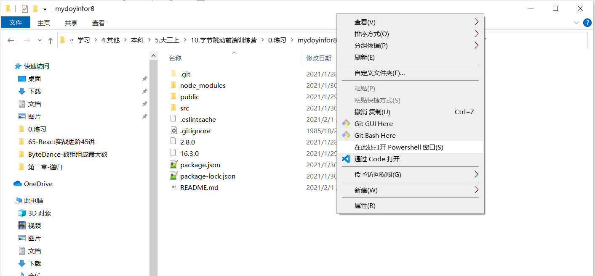

# mydouyinfor8

## 进入项目

1. 安装`node.js`环境，在项目文件夹下进入控制台（shift+鼠标右键，点击打开Powershell窗口） 

   ``` 
   npm start
   //启动项目
   ```

   

# 需要安装的库

1. `antd` 组件库

   ``` 
   npm install antd --save
   ```

2. 路由模块

   ``` 
   npm install react-router-dom --save
   ```

3. `axios`

   ``` 
   npm install axios
   ```

4. 视频播放器模块

   ```
   npm install xgplayer//西瓜播放器
   ```

   `griffith`播放器，git项目链接：https://github.com/zhihu/griffith

   ```
   npm install griffith //这是我找到的另一个视频播放器
   ```

   

5. 如有遗漏的，请根据报错提示安装对应的库 

## Todos

- [x] 通过`<video>`标签实现视频播放 (2021/02/06)
- [x] 通过右上角的按钮实现视频的切换  (2021/02/06)
- [x] 实现点赞与取消的功能 (2021/02/06)
- [x] 实现页面的登陆页面 (2021/02/06)
- [x] 登陆后的sign传回主页面
- [x] 上下滑切换视频
   
# Contributing

暂时采取下文所述的 Github flow. 提交 PR 后至少请一位同学进行 review, 通过 review 后再 merge 到 C 端项目前端主分支 `C-side-frontend-main` 中.

http://www.ruanyifeng.com/blog/2015/12/git-workflow.html